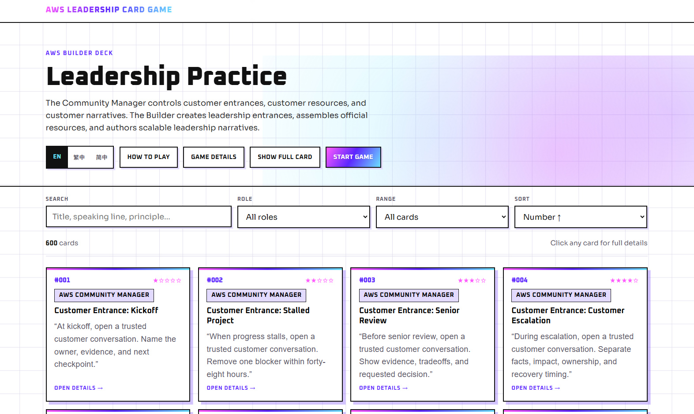
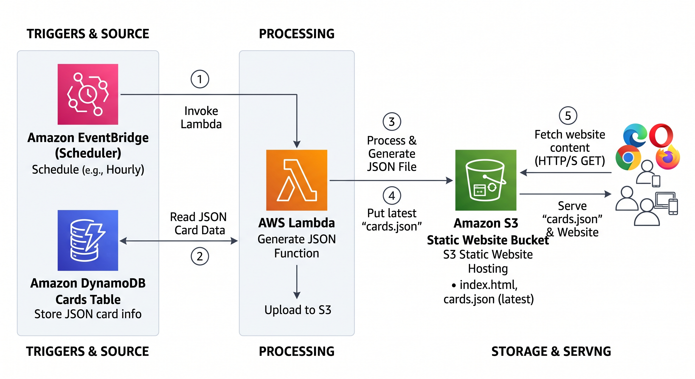

# Weekend Creative Challenge: AWS Leadership Card Game

#creative-expression

**Live app:** [https://aws-user-group.com/demo/aws_leadership_card_game/index.html](https://aws-user-group.com/demo/aws_leadership_card_game/index.html)

## Vision and What the App Does

The **AWS Leadership Card Game** is a browser-based creative facilitation tool that turns difficult workplace conversations into a structured card-playing experience. I wanted to build something more expressive than a reference page and more practical than a list of leadership advice. The result is an interactive deck that helps teams, community leaders, builders, and facilitators rehearse what they might actually say when a situation becomes ambiguous, political, tense, or high stakes.

The app contains a collection of 600 leadership practice cards. Each card is a small creative artifact with a number, title, role, leadership principle, skill rating, speaking line, side effect, advantage, and a suggestion for combining it with other cards. Instead of telling a player only to “communicate better,” a card gives the player language that can be spoken, adapted, challenged, and discussed. That makes the output of the app both creative and usable: it produces combinations of prompts, dialogue, role-play, reflection, and collaborative storytelling around realistic leadership situations.

The cards are organized into three broad ranges. Cards 001 through 150 focus on the Community Manager role, cards 151 through 300 focus on the Builder role, and cards 301 through 600 introduce advanced situations. The advanced deck covers challenges such as executive conflict, angry stakeholders, public blame, unsafe dissent, irreversible decisions, trust recovery, and difficult cross-functional work. A one-to-five-star skill indicator helps players understand the relative difficulty of applying each card.

The website supports two complementary ways to use the content. In browse mode, a user can search across titles, speaking lines, principles, advantages, and side effects. Cards can be filtered by role or number range and sorted by number or skill level. A compact view makes the large deck easy to scan, while the full-card option exposes all of the card fields. Selecting a card opens a focused detail view.

In game mode, two to six players can enter their names and choose a basic or advanced deck. Each player receives three randomly selected cards. The active speaker can discuss or act on a card, move to the next speaker, and start a new round with newly dealt cards. This transforms a static dataset into a social activity. A facilitator can use it for a workshop, a team can use it to discuss a current challenge, or an individual can draw cards as writing prompts for reflecting on a decision.

Language accessibility was also part of the vision. The interface is designed to load separate JSON files for English, Traditional Chinese, and Simplified Chinese. Because the interface and creative content are separated, the deck can grow into new languages without rebuilding the application itself.

### How to Play: Step by Step

The game is designed to work for individual reflection, a small team conversation, or a facilitator-led workshop. A typical session follows these steps:

1. **Open the app and choose a language.** Start the AWS Leadership Card Game in a browser. Use the language selector to choose English, Traditional Chinese, or Simplified Chinese. The interface and card content update to the selected language.

2. **Browse the deck or start a game.** Use browse mode when you want to explore specific leadership situations. Select **Start Game** when you want a structured group activity with randomly dealt cards.

3. **Choose the number of players.** A game can include two to six players. Enter each participant's name so the app can display individual hands and clearly identify the current speaker.

4. **Select a difficulty level.** Choose the basic deck for cards 001 through 300, which focuses on Community Manager and Builder situations. Choose the advanced deck for cards 301 through 600, which introduces more difficult leadership and conflict scenarios.

5. **Deal three cards to each player.** After the game starts, the app shuffles the selected card pool and gives every player three cards. Each hand provides multiple ways to approach the conversation rather than forcing a single answer.

6. **Let the active player choose a card.** The current speaker reviews the three available cards and selects the one that best fits a real or imagined workplace challenge. Selecting the card opens its complete details.

7. **Read or adapt the speaking line.** The player reads the card's speaking line aloud or adjusts it naturally for the situation. The goal is to practice language that could be used in an actual conversation, not simply to describe a leadership principle in the abstract.

8. **Discuss the action and tradeoff.** Review the leadership principle, side effect, and advantage shown on the card. The player explains what action they would take, what benefit they expect, and what cost or risk they must accept. Other players can ask questions, offer evidence, or describe how a stakeholder might respond.

9. **Explore card combinations.** Use the card's combination guidance to connect it with another card or leadership approach. This encourages players to develop a more complete strategy and shows that difficult situations rarely have a one-card solution.

10. **Move to the next speaker.** Select **Next Speaker** after the active player has completed the discussion. The app rotates the active role so every participant receives an opportunity to contribute.

11. **End the round and deal new cards.** After all players have spoken, select **End Round · New Cards**. The current hands move to the discard pile, the round counter advances, and each player receives three new cards.

12. **Reflect on what changed.** At the end of the session, discuss which speaking lines felt useful, which side effects were hardest to accept, and whether the proposed actions created a repeatable opportunity for others. A facilitator can capture the strongest ideas as follow-up actions for the team.

For a shorter solo experience, a user can stay in browse mode, filter the deck by role or difficulty, open one card, and write a response to its speaking line, advantage, and side effect. This makes the same app useful as both a multiplayer facilitation game and a personal creative reflection tool.

### How to Play: Step by Step

The game is designed to work for individual reflection, a small team conversation, or a facilitator-led workshop. A typical session follows these steps:

1. **Open the app and choose a language.** Start the AWS Leadership Card Game in a browser. Use the language selector to choose English, Traditional Chinese, or Simplified Chinese. The interface and card content update to the selected language.

2. **Browse the deck or start a game.** Use browse mode when you want to explore specific leadership situations. Select **Start Game** when you want a structured group activity with randomly dealt cards.

3. **Choose the number of players.** A game can include two to six players. Enter each participant's name so the app can display individual hands and clearly identify the current speaker.

4. **Select a difficulty level.** Choose the basic deck for cards 001 through 300, which focuses on Community Manager and Builder situations. Choose the advanced deck for cards 301 through 600, which introduces more difficult leadership and conflict scenarios.

5. **Deal three cards to each player.** After the game starts, the app shuffles the selected card pool and gives every player three cards. Each hand provides multiple ways to approach the conversation rather than forcing a single answer.

6. **Let the active player choose a card.** The current speaker reviews the three available cards and selects the one that best fits a real or imagined workplace challenge. Selecting the card opens its complete details.

7. **Read or adapt the speaking line.** The player reads the card's speaking line aloud or adjusts it naturally for the situation. The goal is to practice language that could be used in an actual conversation, not simply to describe a leadership principle in the abstract.

8. **Discuss the action and tradeoff.** Review the leadership principle, side effect, and advantage shown on the card. The player explains what action they would take, what benefit they expect, and what cost or risk they must accept. Other players can ask questions, offer evidence, or describe how a stakeholder might respond.

9. **Explore card combinations.** Use the card's combination guidance to connect it with another card or leadership approach. This encourages players to develop a more complete strategy and shows that difficult situations rarely have a one-card solution.

10. **Move to the next speaker.** Select **Next Speaker** after the active player has completed the discussion. The app rotates the active role so every participant receives an opportunity to contribute.

11. **End the round and deal new cards.** After all players have spoken, select **End Round · New Cards**. The current hands move to the discard pile, the round counter advances, and each player receives three new cards.

12. **Reflect on what changed.** At the end of the session, discuss which speaking lines felt useful, which side effects were hardest to accept, and whether the proposed actions created a repeatable opportunity for others. A facilitator can capture the strongest ideas as follow-up actions for the team.

For a shorter solo experience, a user can stay in browse mode, filter the deck by role or difficulty, open one card, and write a response to its speaking line, advantage, and side effect. This makes the same app useful as both a multiplayer facilitation game and a personal creative reflection tool.

## How I Built It

### Starting with the smallest useful experience

I began with a focused MVP: load a JSON file, render a grid of cards, and allow a user to open one card for its full details. This was intentionally simple. The challenge encouraged builders to make one creative idea work well instead of over-engineering an entire platform. A static frontend also made it possible to iterate quickly without waiting for a complex deployment pipeline.

I built the interface with semantic HTML, CSS, and vanilla JavaScript. Avoiding a frontend framework was a deliberate decision. The app does not require server-side rendering or a large client dependency graph. A single-page static site keeps the download small, reduces maintenance, and works naturally with Amazon S3 static website hosting.

Once basic rendering worked, I added discovery features. Client-side search builds a searchable text value from the card number, title, role, leadership principle, speaking line, advantage, side effect, and combination guidance. Role and range filters let users narrow the deck without sending requests to a backend. Sorting supports ascending and descending card numbers as well as descending skill ratings. All of these interactions happen locally after the JSON file loads, so they feel immediate.

The next iteration added game mechanics. I created a Fisher-Yates-style shuffle, separated basic and advanced card pools, and implemented draw and discard piles. Each player receives three cards per round. At the end of a round, the current hands move to the discard pile and new hands are dealt. When necessary, discarded cards can be reshuffled back into the draw pile. I kept the game state in the browser because the challenge version does not require accounts, saved sessions, or real-time multiplayer synchronization.

### Separating the source of truth from the published artifact

The most important architecture decision was to avoid treating the JSON file in the website bucket as the editing database. The website needs one optimized asset that is easy to fetch, but the content workflow needs individual records that can be updated safely. I therefore use **Amazon DynamoDB as the system of record** for card information. Each card is stored as a JSON-like DynamoDB item with a stable card identifier and the fields required by the frontend.

A scheduled **AWS Lambda** function reads the current card records from DynamoDB, validates and orders them, wraps them in the JSON structure expected by the website, and writes the latest generated file to the S3 website bucket. **Amazon EventBridge Scheduler** invokes that Lambda function on a recurring schedule. This keeps content administration separate from content delivery while still giving the static website a fresh, predictable data file.

This pattern was useful because the browser never needs permission to query DynamoDB directly. It only performs an HTTP request for a static JSON object in the same site. That reduces frontend complexity and prevents database credentials or write operations from being exposed to visitors.

### Key decisions

1. **Use S3 for the frontend.** The application is made entirely of static assets, so I selected S3 static website hosting rather than running a web server.
2. **Use DynamoDB for editable card records.** Individual cards can be created or updated without manually editing one enormous production file.
3. **Publish a generated snapshot.** Lambda converts database records into a version suitable for fast browser delivery.
4. **Schedule publication.** EventBridge Scheduler makes the refresh repeatable and removes a manual export step.
5. **Keep interaction in the browser.** Search, filtering, sorting, shuffling, dealing, language switching, and modal views do not need a request for every action.
6. **Keep localization data-driven.** The frontend maps each language to a corresponding card JSON file, which makes additional language versions straightforward.
7. **Design for mobile and accessibility.** Responsive layouts, visible labels, keyboard-friendly buttons, dialog semantics, escape-key handling, readable type sizes, and reduced-motion behavior were included from the start.

### Challenges and How I Overcame Them

The first challenge was the size and consistency of the deck. Six hundred cards contain many repeated fields, and a malformed record could break rendering or create a confusing experience. I addressed this by defining a consistent item shape and making the Lambda export step responsible for validation. The export should reject or report records without required identifiers, normalize optional text values, sort cards deterministically, and produce valid UTF-8 JSON. This creates a quality gate between editable data and the public website.

The second challenge was keeping the website fresh without making it dynamic. A static site is inexpensive and reliable, but static files can become stale. The scheduled Lambda job solved this by regenerating the public JSON snapshot from DynamoDB. Uploading to a consistent S3 object key means the frontend does not need to know which database revision is active. For production hardening, the generated output can first be written to a temporary key, validated, and then copied to the final key so visitors never receive a partially written artifact.

A third challenge was client-side performance. Rendering hundreds of rich cards can become expensive on smaller devices. I kept the card markup compact, performed filtering in memory, rendered only the active result set, and used a modal for expanded details rather than placing every field in every card by default. The compact/full-card toggle gives users control over information density.

The fourth challenge involved AWS permissions. The Lambda function needs to read the DynamoDB table and write specific generated objects to S3, but it should not have broad administrative access. I used a dedicated IAM execution role and a least-privilege policy restricted to the required table and bucket prefix. CloudWatch Logs from the Lambda runtime provide an audit trail for export counts, validation failures, and upload errors.

Finally, creative design was a challenge of its own. A card had to be concise enough to use during a live conversation while still showing tradeoffs. The combination of a speaking line, side effect, advantage, and card-combination suggestion prevents the advice from feeling one-dimensional. It invites the player to think about both action and consequence.

## AWS Services Used and Architecture Overview

### Amazon S3

Amazon S3 hosts `index.html`, styles, browser-side JavaScript, images, and generated multilingual card files such as `card_en.json`. S3 static website hosting provides the public entry point and serves the assets requested by the browser. The bucket is dedicated to delivery, not content editing.

### Amazon DynamoDB

DynamoDB stores each card as an independent item. A stable identifier acts as the partition key, while attributes hold the number, title, role, leadership principle, speaking line, side effect, advantage, combination guidance, and skill rating. This model supports targeted updates and future additions such as status, language, deck version, or review metadata.

### AWS Lambda

The export Lambda function reads the table, handles pagination when scanning or querying, validates the records, sorts them, assembles the expected JSON payload, and writes the latest output to S3. It also logs the number of exported cards and any validation issues. Keeping this transformation in Lambda means no server needs to run continuously.

### Amazon EventBridge Scheduler

EventBridge Scheduler invokes the export function at a defined interval. The schedule can be hourly, daily, or adjusted to match the content-update frequency. A scheduled snapshot is a good fit because card changes do not need sub-second publication.

### AWS Identity and Access Management

IAM connects the services securely. The scheduler receives permission to invoke only the export Lambda function. The Lambda execution role receives read access to the specific DynamoDB table, write access to the generated S3 object prefix, and permission to create runtime logs.

### Amazon CloudWatch

Lambda writes execution logs to CloudWatch Logs. These logs make it easier to troubleshoot missing records, permission problems, JSON generation failures, and unsuccessful S3 uploads. Metrics and alarms can be added to report function errors or repeated failed invocations.

### Architecture Diagram

### Request and Publication Flow

1. A card is added to or updated in DynamoDB.
2. EventBridge Scheduler invokes the Lambda export function at the configured time.
3. Lambda reads all eligible card items, including additional pages of results when necessary.
4. The function validates required fields and creates an ordered JSON document.
5. Lambda uploads the generated file to the S3 website bucket using the object key expected by the frontend.
6. A visitor opens the site and receives `index.html` from S3.
7. The browser fetches the current language file, such as `card_en.json`, from the same bucket.
8. JavaScript renders the deck and performs subsequent game interactions locally.

This architecture has a useful separation of concerns. DynamoDB is optimized for maintaining records. Lambda is responsible for transformation and publication. S3 is optimized for inexpensive static delivery. EventBridge Scheduler controls freshness. The browser provides the interactive creative experience.

## What I Learned

The biggest lesson was that a creative application does not have to require a complex backend. The creative value in this project comes from the relationship between the card content and the interactions around it. A lightweight static frontend can still support a rich activity when the content model and user flow are designed carefully.

I also learned to think of generated JSON as a publication artifact rather than the source of truth. Before this project, it would have been tempting to upload a large JSON file manually whenever the deck changed. Storing cards individually in DynamoDB and generating a clean snapshot creates a much safer workflow. It supports validation, predictable ordering, automated refreshes, and future editorial tools without adding database calls to the public application.

The challenge strengthened my understanding of scheduled serverless workloads. Lambda is often demonstrated behind an API, but this project uses it as a reliable publishing worker. EventBridge Scheduler provides the timing, Lambda performs a bounded transformation, and S3 receives the result. This is a simple pattern that can also work for catalogs, feeds, reports, configuration snapshots, and localized content bundles.

I gained practical experience with IAM boundaries as well. It is easy to make an early prototype work by granting broad permissions, but the final architecture is clearer when every permission corresponds to a specific data flow. The scheduler invokes one function. The function reads one table, writes to one bucket prefix, and emits logs. Thinking through those boundaries improved both security and my understanding of the system.

On the frontend, I learned that progressive complexity is valuable. I did not start by implementing multilingual gameplay for six players. I started by making one card render correctly. Search and filters came next, followed by detail views, language switching, the full-deck display, and finally the multiplayer round flow. Each layer reused the same normalized card objects, so the application grew without requiring a rewrite.

I also learned that accessibility and responsiveness are creative constraints, not cleanup tasks. A card game that works only with a mouse or only on a desktop excludes many potential workshop settings. Responsive single-column layouts, usable touch targets, keyboard behavior, clear focusable controls, dialog labels, and reduced-motion support make the experience more adaptable.

Most importantly, I learned how content structure shapes conversation. The “speaking line” makes the advice concrete. The “side effect” acknowledges that leadership actions have costs. The “advantage” explains the potential payoff. The “combination” field encourages players to connect ideas rather than treat each card as an isolated rule. Technology delivers the deck, but this repeated creative structure is what makes the app useful.

## Link to the App

Try the deployed application here:

**Live app:** [https://aws-user-group.com/demo/aws_leadership_card_game/index.html](https://aws-user-group.com/demo/aws_leadership_card_game/index.html)

The live app is the main submission link. It demonstrates the searchable card library, detailed card views, language switching, basic and advanced decks, player setup, random dealing, speaker rotation, and new-round flow.

## Closing Thoughts

The AWS Leadership Card Game started as a weekend idea: turn leadership guidance into cards that people can actually speak and play. Keeping the first version focused allowed me to invest in the experience instead of infrastructure. S3 provides the static website, DynamoDB stores structured card records, Lambda converts those records into the latest website-ready JSON, and EventBridge Scheduler keeps publication automatic.

The project also leaves room to grow. Future versions could add an authenticated editorial interface, draft and published states, deck versioning, additional languages, usage analytics that respect player privacy, or CloudFront for HTTPS delivery and global caching. The core architecture does not need to change for those additions. The important foundation is already present: a clear source of truth, an automated publishing path, a fast static experience, and a creative format that helps people practice better conversations.

If a player draws one card and finds a more thoughtful way to approach a difficult discussion, the app has done its job. If a facilitator uses the deck to help a team create repeatable opportunities for others, it has done even more.
